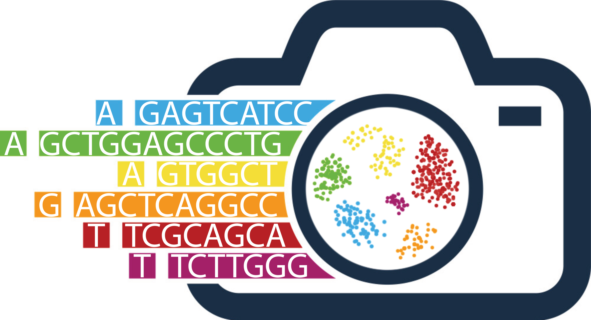

<p align="center">
  
</p>
<p align="center">
  <a href="https://github.com/stjudeDNBBinfCore/sc-rna-seq-snap/blob/main/LICENSE"></a>
</p>


# Single cell RNA Seq Snap workflow (ScRNASeqSnap)

This repository contains tools and workflows for analyzing single cell and single nuclei RNA (sc/snRNA) data from 10X sequencing technology. 

The `sc-rna-seq-snap` repository is an initiative of the [Bioinformatics Core at the Department of Developmental Neurobiology at the St. Jude Children's Research Hospital](https://www.stjude.org/research/departments/developmental-neurobiology/shared-resources/bioinformatic-core.html).


⚠️ 🚧 The repo is currently under development and code review process. 🚧 ⚠️ 


## To reproduce the code in this repository:

This repository contains tools and pipelines for the repository noted above.


1. Clone the repository
```
git clone https://github.com/stjudeDNBBinfCore/sc-rna-seq-snap.git
```

2. Navigate to an analysis module and run the shell script:
```
cd /home/rstudio/sc-rna-seq-snap/analyses/<module_of_interest>
```

### Below is the main directory structure listing the analyses and data files used in this repository

```
├── analyses
|  ├── ...
|  ├── ...
|  └── ...
├── figures
|   ├── img
|        ├── DNB_BINF_Core_logo.png
|        └── ScRNASeqSnap_logo.png
|   ├── palettes
|       ├── binary_color_palette.tsv
|       └── qc_color_palette.tsv
|   ├── README.md
|   ├── scripts
|       ├── create_color_palette_project.R
|       └── theme_plot.R
├── gitignore.txt
├── LICENSE
└── README.md
```

## Contact

Contributions, issues, and feature requests are welcome! Please feel free to check [issues](https://github.com/stjudeDNBBinfCore/sc-rna-seq-snap/issues).

---

*These tools and pipelines have been developed by the Bioinformatic core team at the [St. Jude Children's Research Hospital](https://www.stjude.org/). These are open access materials distributed under the terms of the [BSD 2-Clause License](https://opensource.org/license/bsd-2-clause), which permits unrestricted use, distribution, and reproduction in any medium, provided the original author and source are credited.*
